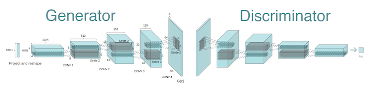

# Deep Learning - Face Generation

## Table of Contents
- [Overview](#Overview)
- [Dependencies](#Dependencies)
- [Data](#Data)
- [Sample Output](#Sample-Output)

## Overview
In following project, Tensorflow Deep Convolutional Generative Adversarial Network (DCGAN) is implemented to generate fake images of human face. By using the face [images of celebrities](https://www.kaggle.com/greg115/celebrities-100k), network will mimic the image, generating face images as realistic as possible.  

Below is the demonstration of DCGAN structure:

Key factor of DCGAN is having two models, discriminator and generator. Both discriminator and generator is trained to perform better. Discriminator learns to discriminate whether image is real or fake, while generator learns to generate more and more realistic images. By letting discriminator and generator to compete each other, DCGAN is able to generate better, more realistic image.

## Dependencies

This project requires **Python 2.7** and the following Python libraries installed:

- [NumPy](http://www.numpy.org/)
- [Pytorch](https://pytorch.org/)
- [Matplotlib](https://matplotlib.org/)

You will also need to have software installed to run and execute a [Jupyter Notebook](http://ipython.org/notebook.html)

If you do not have Python installed yet, it is highly recommended that you install the [Anaconda](http://continuum.io/downloads) distribution of Python, which already has the above packages and more included. Make sure that you select the Python 2.7 installer and not the Python 3.x installer.

## Data
In following project, [facial images of celebrities](https://www.kaggle.com/greg115/celebrities-100k) provided from [Kaggle](https://www.kaggle.com/), is used for training the model.

## Sample Output
Here is the final output from DCGAN trained in following project:

Although not all the images look realistic, most of the images are quite realistic. DCGAN seems to be trained enough to produce realistic facial image. One thing to consider, as most of the training images were caucasian, therefore output facial images has very similar skin color. 
